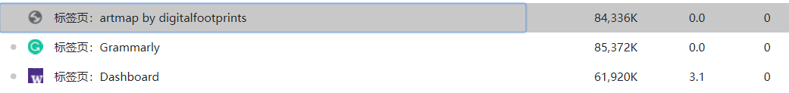
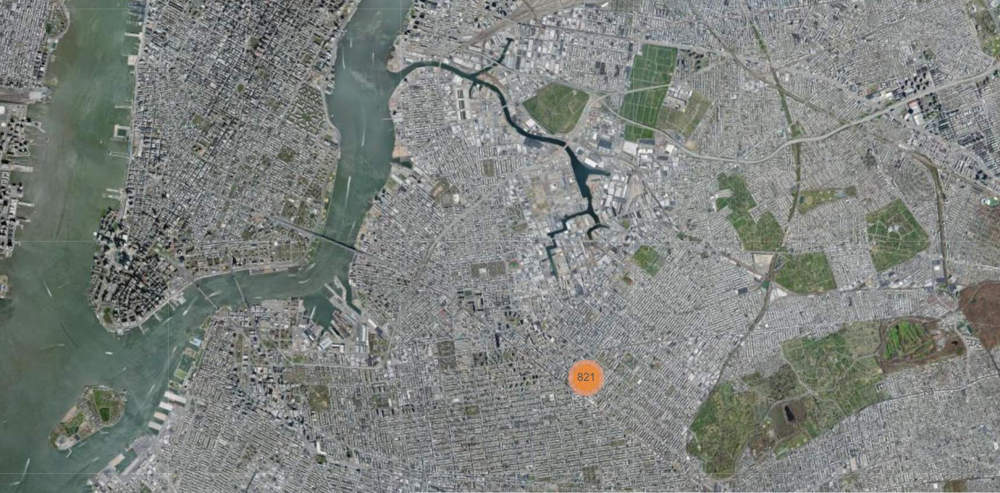

# THE GEOGRAPHY OF PUBLIC DOMAIN OBJECTS AT THE METROPOLITAN MUSEUM OF ART Analysis </a>

## Section 1: Introduction
### *THE GEOGRAPHY OF PUBLIC DOMAIN OBJECTS AT THE METROPOLITAN MUSEUM OF ART* </a> is a <a href=https://digitalfootprints.github.io/artmap>web map project</a>, which allows users to access a world-class collection of art and antiquities at their fingertips. This web map contains two main sections: 1) a web map to represent the artworks' location; 2) a web page that displays the artwork's information; The web map contains clustered markers that display global artworks' location. It will show more markers at the time the user zoom in on the map.This feature provides a cartographic visualization of a variety of relationships between art and geography through time.

### Each marker is also linked with a popup and a web page that displays the artwork's information with inclusion of the high-resolution scanned images of the original artwork that is in the public domain. For additional narrative content on an object, clicking on the title of the object will open a new bowser tab to the object page on The Metropolitan Museum of Art webpage. Standard pan and zoom capabilities are available using the +/- buttons on the map, or by using the the scroll wheel on the mouse. Two base maps and fifteen layers are included for user filter purposes by artworks' type and age.

### Since the information on the web map does not involve professional knowledge and terminology，the audience of this map could be anyone who in favor of the global artwork. Due to the form of web-map, the audience restricts to the user with a basic understanding of the internet and computer. The overall map design is convenient and intuitive for any user with a basic computer experience. However, the exception is one of the highest zoom levels where a user has to click a cluster to further present each marker, especially in the location with a huge group.

### This increase the difficulty of interacting with the map and could further reduce the audience into user with experience with marker cluster feature in a web map. Even though this links the location and artwork's physical location, it doesn't contain a detailed description and even the museum name. Therefore, this map cannot serve as an academic or travel advice purpose but an entertainment and general education purpose only. This could be inspiring for them by viewing images of some of the most important historical and artistic works in existence.  
### Sharon Wohlgemuth is the only author of this web map. There are two contributors to the project from the <a href=https://github.com/digitalfootprints/artmap>Github page</a>: <a href=https://github.com/digitalfootprints>digitalfootprints</a> and <a href=https://github.com/rgdonohue>Rich Donohue</a>. Both Sharon Wohlgemuth and digitalfootprints do not have personal information avalible from either github or google. However, the contributor Rich Donohue is a Web Cartographer, Geographer, and Associate Professor teaching online web mapping courses for <a href=https://geography.as.uky.edu/user/10576>New Maps Plus in University of kentucky</a>. I would assume Sharon Wohlgemuth is a student of Rich Donohue. The data for this map is being made available by <a href=https://github.com/metmuseum>The Metropolitan Museum of Art Open Access GitHub</a>, and <a href=https://metmuseum.github.io>The Metropolitan Museum of Art Collection API</a> in CSV form , encoded in UTF-8. The Metropolitan Museum of Art provides select datasets of information on more than 470,000 artworks in its Collection for unrestricted commercial and noncommercial use.The Metropolitan Museum of Art Collection API is same as The Metropolitan Museum of Art but can provide picture and image from api link. For instance: <a herf=https://collectionapi.metmuseum.org/public/collection/v1/objects/999> https://collectionapi.metmuseum.org/public/collection/v1/objects/999 </a> contains a json file of the artwork with a image file path: <a herf=https://images.metmuseum.org/CRDImages/ad/original/DP258638.jpg> https://images.metmuseum.org/CRDImages/ad/original/DP258638.jpg </a>.

## Section 2: Systematic Architecture
### The is a single client-side web page without any customed backend server. It does have a third-party API available for data collection, The Metropolitan Museum of Art Collection API. However, the only purpose of this API is to gather pictures from the return  <a herf=https://collectionapi.metmuseum.org/public/collection/v1/objects/999>JSON object</a> from a get request. All other information, includes name, location, website, etc are stored and used from the local repository: <a herf=https://github.com/digitalfootprints/artmap/blob/master/data/merge.json>/data/merge.Json</a>. Besides the API，the technology stack and JavaScript libraries used are:
#### HTML/SVG/CSS/JS,
#### <a href=https://leafletjs.com>Leaflet</a>, an open-source JavaScript library for mobile-friendly interactive maps;
#### <a href=https://github.com/Leaflet/Leaflet.markercluster>Leaflet.markercluster</a>,  an open-source JavaScript library to provide Beautiful Animated Marker Clustering functionality for Leaflet;
#### <a href="https://jquery.com/">Jquery</a>, a JavaScript library It makes things like HTML document traversal and manipulation, event handling, animation, and Ajax much simpler;
#### <a href=https://d3js.org>D3.js</a>, a JavaScript library for manipulating documents based on data;
#### <a href=https://getbootstrap.com>Bootstrap</a>, a web UI framework for mobile-first sites, with jsDelivr and a template starter page;
#### <a href=https://fontawesome.com/v4.7.0/>Font Awesome 4,7</a>, a online css icon api which  gives you scalable vector icons that can instantly be customized';
### There is not data flow between server and client beside a Json (res.Json) and a picture file(res.File). Only two main function are contained in the source file: getImageInfo, and drawMap.However, the drawMap is heavily redundant on the code. With 15 redundant draw marker statements for each layer and identical add marker cluster statement and event listener for each cluster.The entire JS part is load since the website is opened without any protection. This could lead to a fatal error where JS is loaded when HTML is not due to a client device problem.  This could be easily avoided by two lines of code:
#### window.addEventListener("load", init);
#### function init() { all js code in here }
### Through the entire program, there is no error handling and async function for any fetch request. The entire program is extremely unstable under potential connection issues without error handling. Furthermore, due to all 15 layers are loaded at the same and remain on the client through the entire progress. With more than server thousands of marker on the map, the entire program is extremely inefficient on the ram using prospective.For instance, under normal usage, the web map takes even more ram usage than Canvas which is a far more complicated website with more lines of code. From a client project perspective, this is extremely inefficient and unfriendly to users with old devices on both mobile phones and PC.

###Since all codes, HTML, CSS, and JS are all merged into a single HTML file, this is extremely hard to maintain and upgrade. The naming of the variable is going to cause severe maintain the issue. By considering the heavily redundant function, I would doubt if the author can still read his own code after years. Regarding the maintains, the comment throughout the entire JS part is the only impressive and useful feature for any third party to read the code with those internal correctness issues. However, I couldn't understand that why author do not use the API for main information source but a local json file. Since API is always updating by the creator, and JSON has to be updated by author, using API's information can allow the webpage update the artwork through time. It has been more than 1 year since last modification, the web map could lost thousands of of artwork in the API.  

## Section 3: UI/UX
### The overall UI and UX design successfully fit the author's need on the web map on a fundamental level. In detail, some design is a catastrophe. As I mentioned in the previous section, the largest zoom-in level would not automatically trigger the markers. This could an unfriendly design for a new user which is not a fatal mistake. However, whenever any user clicks and opens a cluster with 1000+ points, it is a hedgehog. There is no indication for each artwork type or any detailed information for users but a circle for each marker. It is pure luck for what a user could visit. And revisit a previously visited point is nearly impossible. Even if a user remembers the artwork's name or general location. It is just not possible for any human to remember the precise location of a spine in this hedgehog.

### Another inconvenient design is the multi-thematic layers display. As the map gives the option to select multiple thematic layers at the same time, the UI for this feature is un-usable. The following example is in Europe where only three layers have been selected. There are three clusters locate above another right on Paris which leads to clicking the desired cluster to compare artwork distribution impossible to achieve. The cluster should be load dynamically for this multi-layer display rather than a simple preload everything approach.

### Third, as one of the most important feature that I am expecting from this map, it should display which museum that contains my favorite artworks. At least, I can use the map as a tour recommendation website for any potential museum trip. But it doesn't. The location is imprecise and can only display the general location, on city level. The following picture is the largest cluster in New York. From my research, it is the The Metropolitan Museum of Art in Manhattan, New York. However, what the map's result is in the Brooklyn regtion. Regarding the map does not even provide the name of the museum and the wrong location, it is not a good map in my prespective. I would believe that the Imagery basemap and Imagery basemap are designed to help user to find the precise location of the artwork. However, under the imprecise marker, the base maps can only provide wrong information.

### The UI for the entire web is also mystical. The extremely large forehead and chin have no proper purpose but simply display a title and copy-right. The title can simply replace the "artmap by digitalfootprints" text in the title section of HTML head. The "artmap by digitalfootprints" does not make any sense of the purpose of this map. The chin with copyright information could be easily combined into the leaflet web map section since the author has already dynamically load different information in the attribution section of L.tileLayer. The entire artwork detial section is redundant. This section only displays a picture but nothing else. Considering the abundant information available from the API return JSON, it is a waste of information for users. It should either remove the popup in the map and combine all information available from the API JSON in the side panel or remove the side panel and display current information and pictures in the popup.

