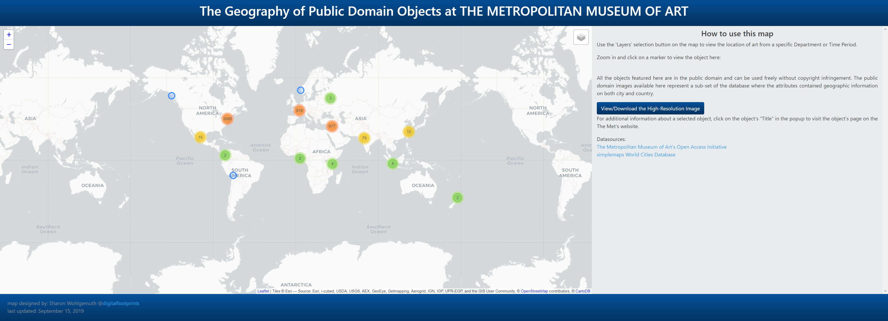
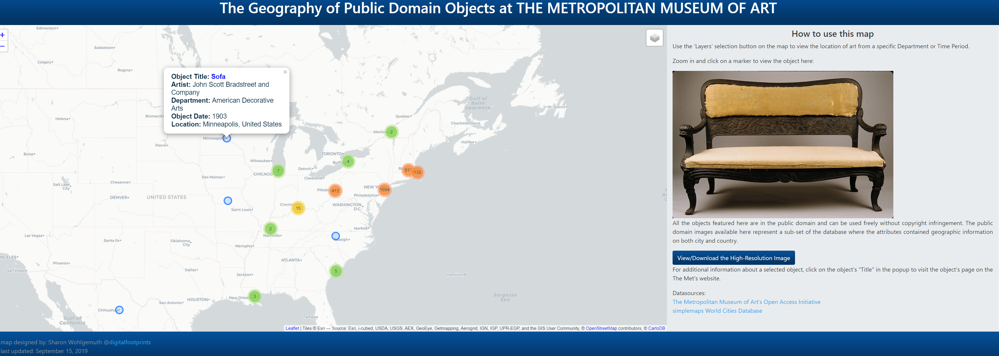
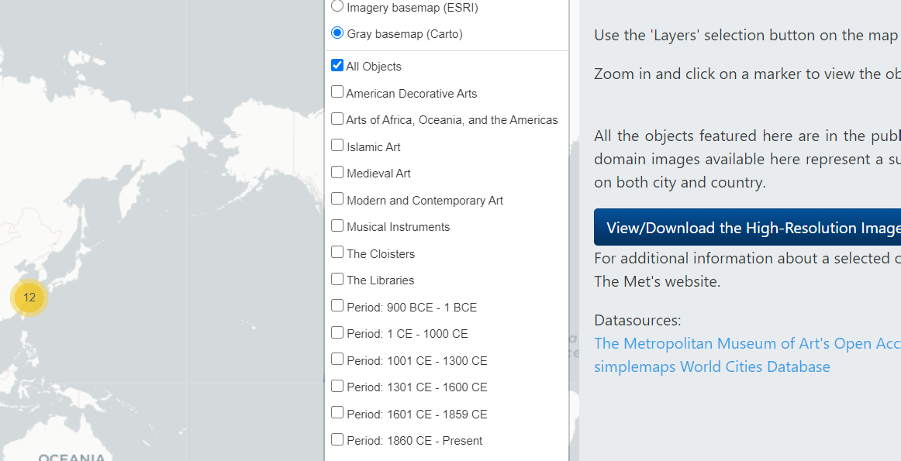
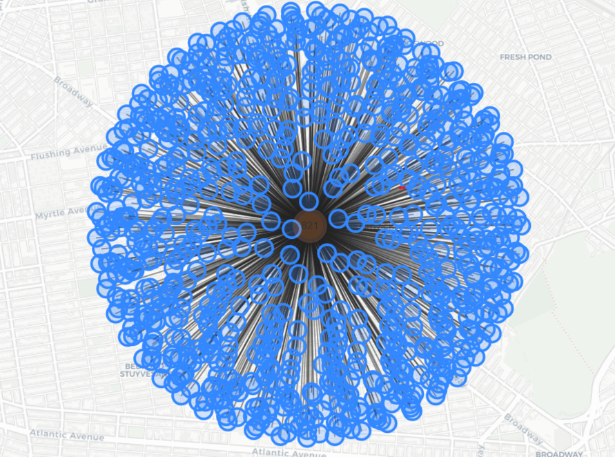

#  <a herf=https://digitalfootprints.github.io/artmap/> THE GEOGRAPHY OF PUBLIC DOMAIN OBJECTS AT THE METROPOLITAN MUSEUM OF ART Analysis </a>

## Section 1: Introduction
### <a herf=https://digitalfootprints.github.io/artmap/> *THE GEOGRAPHY OF PUBLIC DOMAIN OBJECTS AT THE METROPOLITAN MUSEUM OF ART* </a> is a web map project, which allows users to access a world-class collection of art and antiquities at their fingertips. This web map contains two main sections: 1) a web map to represent the artworks' location; 2) a web page that displays the artwork's information; The web map contains clustered markers that display global artworks' location. It will show more markers at the time the user zoom in on the map.This feature provides a cartographic visualization of a variety of relationships between art and geography through time.

### Each marker is also linked with a popup and a web page that displays the artwork's information with inclusion of the high-resolution scanned images of the original artwork that is in the public domain. For additional narrative content on an object, clicking on the title of the object will open a new bowser tab to the object page on The Metropolitan Museum of Art webpage. Standard pan and zoom capabilities are available using the +/- buttons on the map, or by using the the scroll wheel on the mouse. Two base maps and fifteen layers are included for user filter purposes by artworks' type and age.

### Since the information on the web map does not involve professional knowledge and terminology，the audience of this map could be anyone who in favor of the global artwork. Due to the form of web-map, the audience restricts to the user with a basic understanding of the internet and computer. The overall map design is convenient and intuitive for any user with a basic computer experience. However, the exception is one of the highest zoom levels where a user has to click a cluster to further present each marker, especially in the location with a huge group.

#### This increase the difficulty of interacting with the map and could further reduce the audience into user with experience with marker cluster feature in a web map. Even though this links the location and artwork's physical location, it doesn't contain a detailed description and even the museum name. Therefore, this map cannot serve as an academic or travel advice purpose but an entertainment and general education purpose only. This could be inspiring for them by viewing images of some of the most important historical and artistic works in existence.  
### Sharon Wohlgemuth is the only author of this web map. There are two contributors to the project from the <a href=https://github.com/digitalfootprints/artmap>Github page</a>: <a href=https://github.com/digitalfootprints>digitalfootprints</a> and <a href=https://github.com/rgdonohue>Rich Donohue</a>. Both Sharon Wohlgemuth and digitalfootprints do not have personal information avalible from either github or google. However, the contributor Rich Donohue is a Web Cartographer, Geographer, and Associate Professor teaching online web mapping courses for <a href=https://geography.as.uky.edu/user/10576>New Maps Plus in University of kentucky</a>. I would assume Sharon Wohlgemuth is a student of Rich Donohue.
### The data for this map is being made available by <a href=https://github.com/metmuseum>The Metropolitan Museum of Art Open Access GitHub</a>, and <a href=https://metmuseum.github.io>The Metropolitan Museum of Art Collection API</a> in CSV form , encoded in UTF-8. The Metropolitan Museum of Art provides select datasets of information on more than 470,000 artworks in its Collection for unrestricted commercial and noncommercial use.The Metropolitan Museum of Art Collection API is same as The Metropolitan Museum of Art but can provide picture and image from api link. For instance: <a herf=https://collectionapi.metmuseum.org/public/collection/v1/objects/999> https://collectionapi.metmuseum.org/public/collection/v1/objects/999 </a> contains a json file of the artwork with a image file path: <a herf=https://images.metmuseum.org/CRDImages/ad/original/DP258638.jpg> https://images.metmuseum.org/CRDImages/ad/original/DP258638.jpg </a>.
